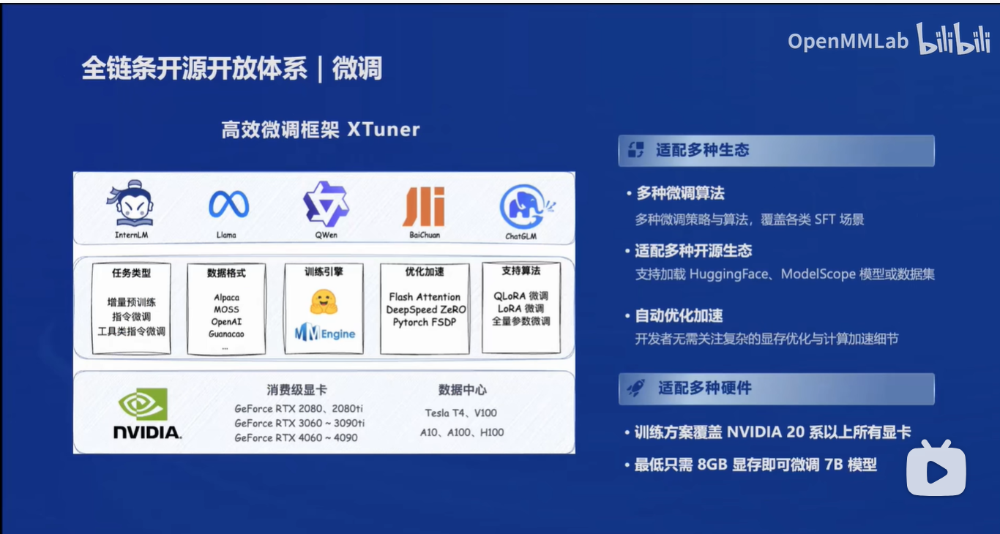

## 第一课 书生·浦语大模型全链路开源体系
主要介绍了 internLM2 的模型体系和关键技术，还有书生浦语的全链条开源开放体系，包括语料、预训练、微调、评测、部署、智能体等环节。

### internLM2 的体系
1. 7B--轻量级，20B--综合性能更强
2. 建议使用 internLM2微调
3. InternLM2-chat拥有很好的共情能力

### internLM2 的关键技术
1. 多维度数据评估
2. 高质量语料
3. 数据补齐

### internLM2 的主要亮点
1. 20万token 上下文
2. 共情，推理、计算能留提升显著
3. 搭建复杂的智能体
4.性能方面：20B 模型可以比肩 GPT3.5

### 可视化，分析能力大幅提升

### 全链条架构--支持微调，评测和多种工具的应用

#### Xtuner--高效的微调框架

#### LMDeploy--提供了部署的全流程

#### 智能体

