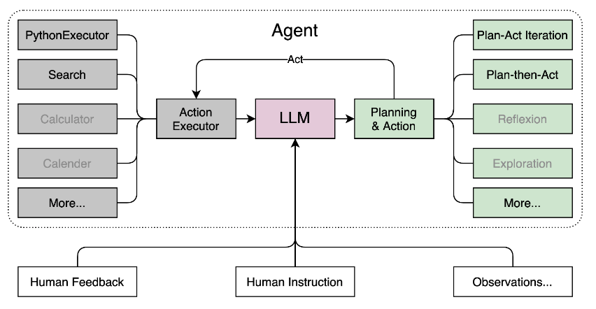

## 大模型趣味 Demo

### 课程主要内容
- 掌握书生·浦语大模型的基础知识，学习搭建环境、下载模型以及进行模型推理，并完成4个demo实战(实战三和四暂未完成)：
  - 实战部署internLM2-Chat-1.8B
  - 实战部署八戒-Chat-1.8B
  - 运行Lagent智能体Demo
  - 灵笔internLM-XComposer2
 
### 部署 InternLM2-Chat-1.8B 模型进行智能对话
- 配置环境
- 下载 InternLM2-Chat-1.8B 模型
- 运行 cli_demo

### 部署实战营优秀作品 八戒-Chat-1.8B 模型
- 配置基础环境
- 下载运行 Chat-八戒 Demo

### 使用 Lagent 运行 InternLM2-Chat-7B 模型
-  Lagent 相关知识
  - Lagent 是一个轻量级、开源的基于大语言模型的智能体（agent）框架，支持用户快速地将一个大语言模型转变为多种类型的智能体，并提供了一些典型工具为大语言模型赋能
    

- 配置基础环境
- 使用 Lagent 运行 InternLM2-Chat-7B 模型为内核的智能体

### 实践部署 浦语·灵笔2 模型
- XComposer2 相关知识
  - 浦语·灵笔2 是基于 书生·浦语2 大语言模型研发的突破性的图文多模态大模型，具有非凡的图文写作和图像理解能力，在多种应用场景表现出色
- 配置基础环境
  - 选用50% A100 进行开发
- 图文写作实战
- 图片理解实战