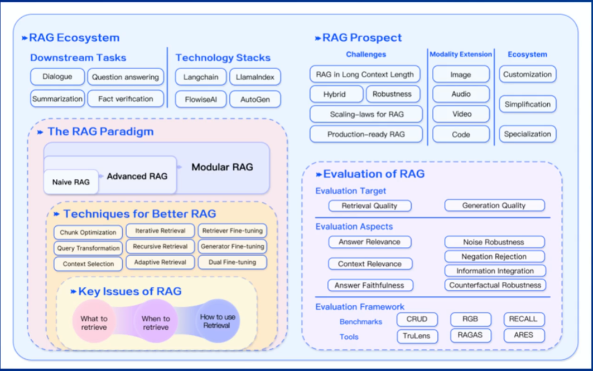
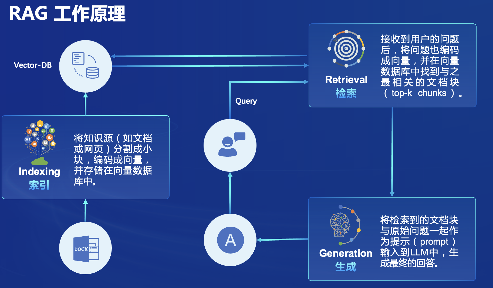
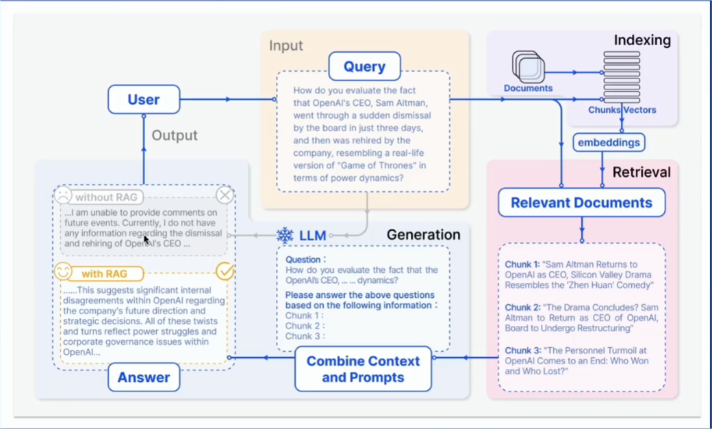
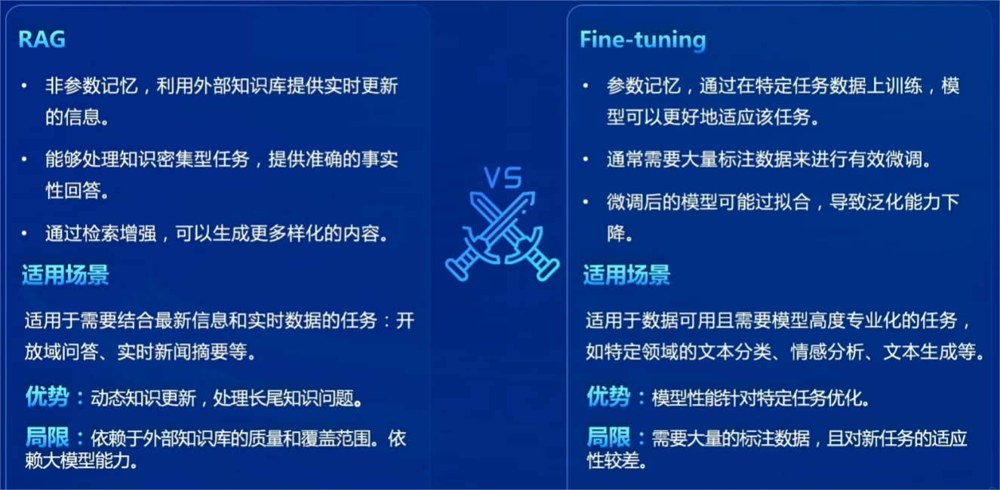

## 第三课——揭秘RAG智能助手：以茴香豆为例

#### 课程目标
- 了解RAG技术的基本原理和应用场景
- 掌握茴香豆的实现原理和功能特点
- 了解茴香豆的部署和使用方法
- 掌握茴香豆的优化策略和最佳实践

#### 课程内容
- RAG技术概述
- 茴香豆项目介绍
- 茴香豆的实现原理和功能特点
- 茴香豆的优化策略和最佳实践

#### 技术概述
- **RAG**，即检索增强生成（Retrieval Augmented Generation），是一种将检索与生成相结合的技术，旨在通过利用**外部知识库**来提升语言模型的性能。它通过检索与用户输入相关的信息片段，生成更准确、更丰富的回答。

**向量数据库（vector-DB）**：
RAG专门用于存储外部数据库的地方

- **数据存储**：将文本等数据通过预训练模型转换为固定长度的向量表示。
- **相似性检索**：根据用户的查询向量，使用向量数据库找出最相关向量的过程。通常通过计算*余弦相似度*或*点乘*来完成。
- **向量表示的优化**：使用更高级的文本编码技术，如句子嵌入或段落嵌入。

#### 工作原理及流程 

#### 发展历程
- `Naive RAG`
  - 问答系统
  - 信息检索
- `Advanced RAG`
  - 摘要生成
  - 内容推荐
- `Modular RAG`
  - 多模态任务
  - 对话系统

#### 常见优化策略
- **嵌入优化（Embedding Optimization）**
  - 结合稀疏和密集检索
  - 多任务
- **索引优化（Indexing Optimization）**
  - 细粒度分割（Chunk）
  - 元数据
- **查询优化（Query Optimization）**
  - 查询扩展、转换
  - 多查询
- **上下文管理（Context Optimization）**
  - 重排（remark）
  - 上下文选择/压缩
- **迭代检索（Iterative Optimization）**
  - 根据初始查询和迄今为止生成的文本进行重复搜索
- **递归检索（Recursive Optimization）**
  - 迭代细化搜索查询
  - 链式推理（Chain-of-Thought）指导检索过程
- **自适应检索（Adaptive Optimization）**
  - Flare，Self-RAG
  - 使用LLMs主动决定检索的最佳时机

#### RAG VS 微调（Fine-tuning）

#### 评估框架和基准测试
- **经典评估指标**：`准确率` `召回率` `F1分数` `BLEU分数` `ROUGE分数`
- **RAG评测框架**
   - 基准测试 - RGB RECALL CRUD
   - 评测工具 - RAGAS ARES Trulens

### 茴香豆——基于LLMs的领域知识助手
#### 简介
茴香豆，一个基于LLMs的领域知识助手，由书生浦语团队开发的开源大模型应用。

- **专为即时通讯工具中的群聊场景优化的工作流**，提供及时准确的技术支持和自动化问答服务。
- **通过应用RAG技术**，茴香豆能够理解和高效准确地回应与特定知识领域相关的复杂查询。

#### 核心特点
- 开源免费
- 高效准确 Hybrid LLMs 专为群聊优化
- 领域知识
- 部署成本低
- 安全 可完全本地部署
- 扩展性强 兼容多种IM软件，支持多种开源LLMs和云端api

#### 工作流程
- **多来源检索**
  - 向量数据库
  - 网络搜索结果
  - 知识图谱
- **混合大模型**
   - 本地LLM
   - 远程LLM
- **多重评分 拒答工作流**
  - 回答有效
  - 避免信息泛滥
- **安全检查**
  - 多种手段
  - 确保回答合规

[茴香豆项目地址](https://github.com/InternLM/HuixiangDou)
