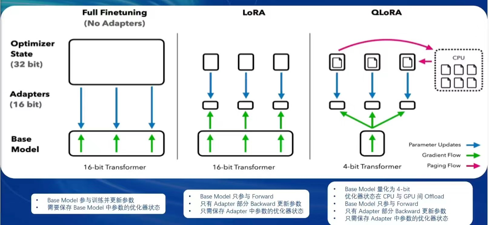
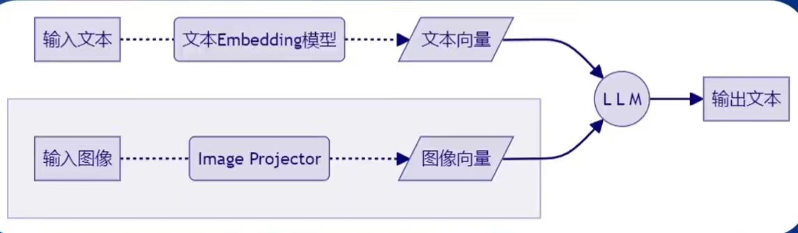
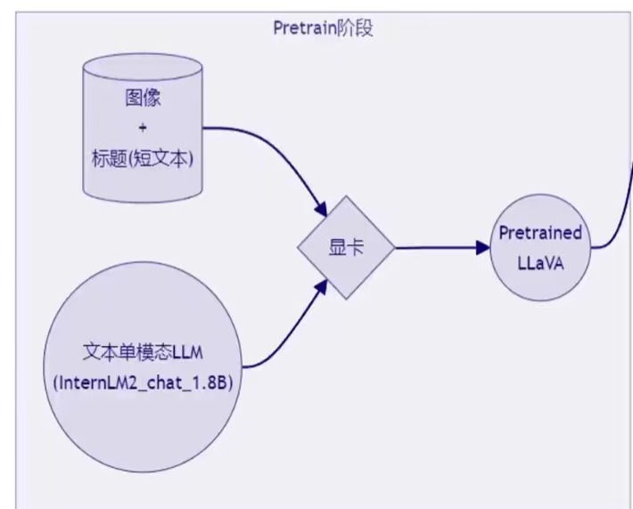
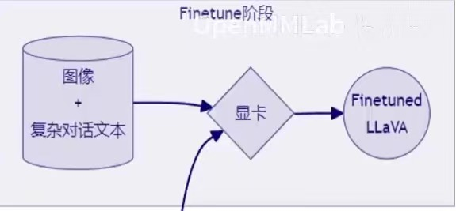

## 第四课—— *XTuner微调小助手*
### 微调理论:

现有大模型常常是基座模型，在某些特定领域的表现不如专门训练的模型，这就是我们为什么要使用微调的原因
--为了获得更高质量的生成数据

#### 两种Finetune范式
* 增量预训练
  * 使用场景：让模型学到新知识，如某个垂直领域的常识
  * 训练数据：文章、书籍、代码等
* 指令跟随微调
   * 使用场景：让模型学到对话模版，根据人类指令进行对话
   * 训练数据：高质量的对话、问答数据

  
`对话模版`是为了让LLM区分出**System**、**User**和**Assistant**

不同的大模型会有不同的对话模板，而XTuner已经封装好了这些模板，我们只用按照它要求的格式输入数据即可
#### LoRA & QLoRA
`LoRA`通过在原本的Linear旁，新增一个支路`Adapter`，包含两个连续的小Linear，参数量远小于之前的Linear，能大幅降低训练的显存消耗  
对比：  
   

### XTuner介绍
  

#### 特点
* 以*配置文件*的形式封装了大部分微调场景
* *轻量级*
#### 优化技巧
* `Flash Attention`  
将Attention计算并进行优化，避免Score NxN的显存占用
* `DeepSpeed ZeRO`  
通过将训练过程中的参数、梯度和优化器状态切片保存，能够在多GPU训练时显著节省显存
### 多模态LLM
#### 简介  
  
#### LLaVA方案
给LLM增加视觉能力的过程，即是训练`Image projector`文件的过程；  
该过程分为两个阶段：`Pretrain`和`Finetune`
* *Pretrain*阶段示意图

 
* *Finetune*阶段示意图

 