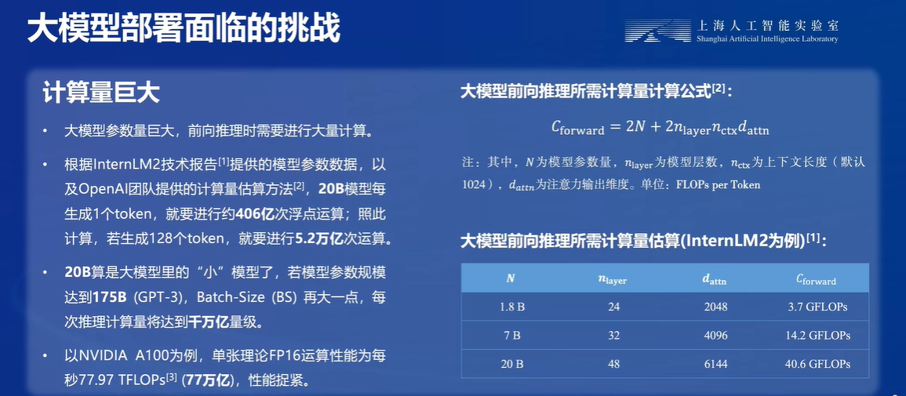
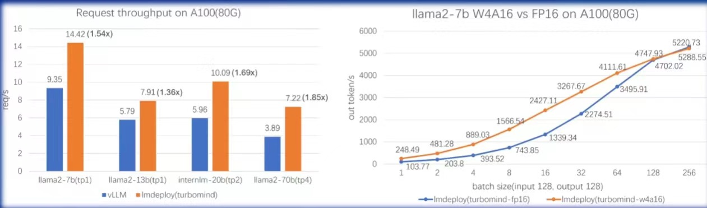

## 第五课——`LMDeploy`量化部署LLM
### 大模型部署
#### 定义
* 在软件工程领域：将开发完毕的软件投入使用
* 在人工智能领域：实现深度学习算法落地应用的关键步骤
#### 场景
* **服务器端**：CPU部署等
* **边缘端/移动端**：移动机器人、手机等
#### 面临的挑战
* 计算量巨大（参数量巨大，前向推理时需要进行大量计算）
 
* 内存开销巨大
* 访存瓶颈
  目前硬件计算速度“远快于”显存带宽
* 动态请求
  * 请求量不确定
  * 请求时间不确定
  * Token逐个生成，生成数量不确定
#### 部署优化方法
* **模型剪枝**
  移除模型中不必要或多余的组件，比如参数，使模型更加高效
  * 非结构化剪枝：移除个别参数，而不考虑整体网络结构
  * 结构化剪枝：根据预定义规则移除连接或分层结构，同时保留整体网状结构
* **知识蒸馏**
  通过引导轻量化的学生模型“模仿”性能更好、结构更复杂的教师模型，不改变其结构而提高其性能
  * 上下文学习
  * 思维链
  * 指令跟随
* **量化**
  将传统方法中的浮点数转化为整数或其他离散形式，以减轻深度学习模型的存储和计算负担
  * 量化感知训练：使LLM适应低精度表示
  * 量化感知微调：确保LLM量化后仍保持其性能
  * 训练后量化：无需对LLM架构进行修改或重新训练
* **反量化**

  * 将量化后的LLM模型进行反量化，以恢复其原始精度
* **量化**与**反量化**其实是降低了模型的计算速度，但提高了访存速度，因为GPU的计算能力远高于访存能力，所以能够提升模型的推理效率
### LMDeploy
#### 简介
`LMDeploy`是涵盖了LLM任务的全套轻量化、部署和服务解决方案
* 高效的推理
* 可靠的量化
* 便捷的服务：通过*请求多发服务*，支持在多卡、多模型上的服务
* 有状态推理：通过缓存多轮对话中的k/v，记住对话历史
#### 核心功能
* 模型高效推理
  `TurboMind`高效推理引擎
* 模型量化压缩
  `W4A16量化（AWQ）`
* 服务化部署
  将LLM封装为HTTP API服务
#### 性能表现
卓越的推理能力  
 
