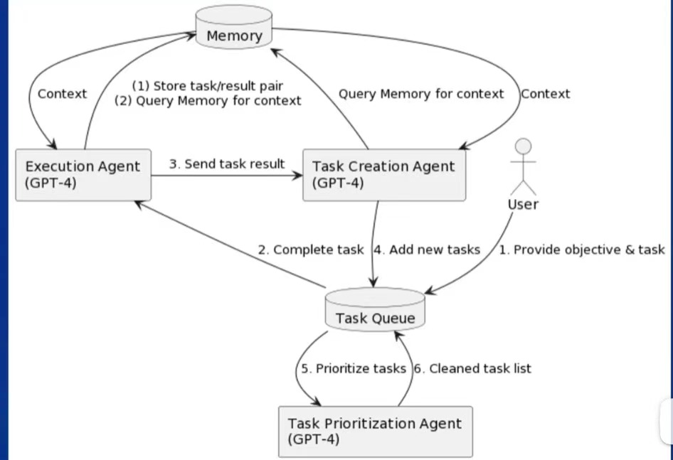
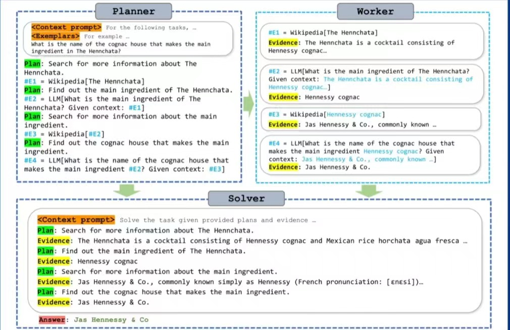
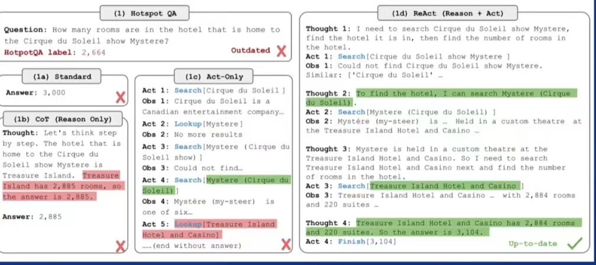
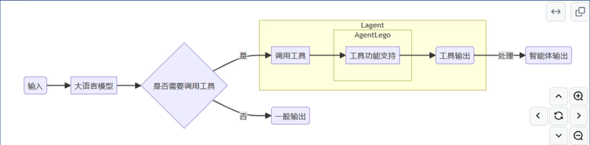

## 第六课——`Lagent`&`AgentLego`智能体应用搭建
### 智能体介绍
#### 起因——大语言模型具有局限性
* 幻觉：
  模型可能会生成虚假信息，与现实世界严重不符或脱轨
* 时效性：
  模型无法理解当前世界，无法理解当前事件，无法理解当前趋势
* 可靠性：
  面对复杂任务（如编写代码），可能频发错误输出的现象
#### 智能体概念
* 可以感知环境中的动态条件
* 能采取动作影响环境
* 能运用推理能力理解信息、解决问题、产生推断、决定动作
#### 智能体范式
* `AutoGPT`

 
* `ReWoo`

 
* `ReAct`

 
### `Lagent`&`AgentLego`
* ***Lagent***
  轻量级开源智能体框架，旨在让用户可以高效地构建基于大语言模型的智能体
  * 支持多种智能体格式
  * 支持多种工具（如谷歌搜索、Python解释器等）
* ***AgentLego***
  多模态工具包，可以快速简便地扩展自定义工具，从而组装出自己的智能体
  * 支持多种智能体框架
  * 提供大量视觉、多模态领域前沿算法
* **两者关系**

 