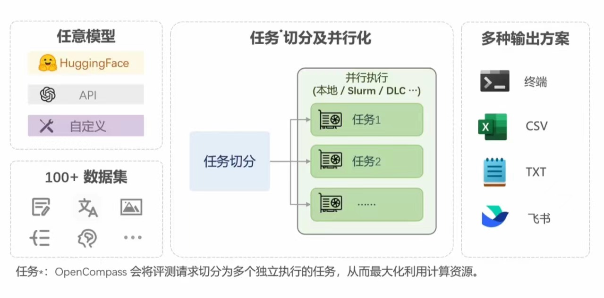

## 第七课——`OpenCompass`大模型评测
### 大语言模型评测简介
#### 背景（为什么要有大语言模型评测？）
* 对于了解大语言模型的优势与限制至关重要
* 有助于指导和改进人类与大型语言模型之间的协同交互
* 帮助研究人员更好地规划大预言模型未来的发展
#### 通过能力评测促进模型发展的方法
* 面向未来，扩展能力维度
* 扎根通用能力，聚焦垂直行业
* 高质量中文基准
* 性能评测，反哺能力迭代
#### 挑战
* **全面性**
  * 应用场景千变万化
  * 模型能力演进迅速
  * 如何设计可扩展的能力维度体系
* **评测成本**
  * 需要大量算力资源
  * 基于人工打分的评测成本高昂
* **数据污染**
  * 海量语料
  * 需要可靠的数据污染检测技术
  * 设计可动态更新的评测基准
* **鲁棒性**
  * 对提示词敏感
  * 多次采样情况下模型性能不稳定
### 评测大模型的方法
#### 模型分类
* ***基座模型***  
  海量数据无监督训练（Base）
* ***对话模型***  
  * 指令数据有监督微调（SFT）
  * 人类偏好对齐（RLHF）
* ***公开权重的开源模型***  
  使用GPU/推理加速卡进行本地推理
* ***API模型***
  发送网络请求获取回复
#### 主观评测 & 客观评测
* 客观问答题
* 客观选择题
* 开放式主观问答
#### 提示词工程
明确性/概念无歧义/逐步引导/具体描述/迭代反馈
#### 长文本评测
* 指令跟随能力
* 长文本建模能力
* 信息抽取能力
### OpenCompass
**评测流水线**
 
* 大模型评测全栈工具`CompassKit`
  * 数据污染检查
  * 长文本能力检测
  * 更丰富的模型推理接入
  * 中英文双语主观评测
* 高质量评测基准社区`CompassHub`
  

